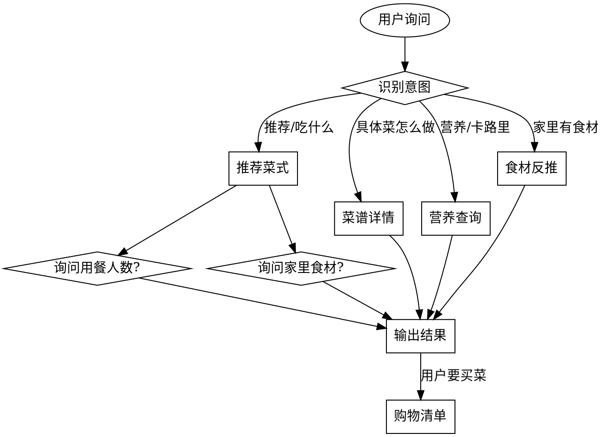

# Cooking Skill

智能烹饪技能，基于 [HowToCook](https://github.com/Anduin2017/HowToCook) 构建。

## Overview

提供菜谱推荐、营养查询、食材反推、购物清单等功能，帮助用户解决"今天吃什么"的问题。

## 前置条件

确保 `cooking-skill` 项目已就绪，索引文件存在：

```bash
ls cooking-skill/data/recipes_index.json
```

如不存在，先构建索引：

```bash
cd cooking-skill && python chef_skill.py build
```

## 何时使用

用户表达以下意图时自动触发：
- "今天吃什么"、"不知道吃什么"
- "想吃点简单的/辣的/低卡的"
- "XX 怎么做"、"XX 多少卡路里"
- "家里有 XX 能做什么菜"
- "推荐几道菜，我要去买菜"

## 交互流程



## 参数收集

### 推荐时主动询问

| 参数 | 询问方式 | 默认值 |
|------|---------|--------|
| 用餐人数 | "几个人吃饭？" | 2 人 |
| 场景 | "工作日快手菜还是周末大餐？" | 工作日 |
| 饮食偏好 | "有没有忌口或想吃的口味？" | 无 |
| 家中食材 | "家里有哪些食材？（没有就跳过，生成购物清单）" | 无 |

## 命令执行

通过 `chef_skill.py` 执行操作，在 `cooking-skill/` 目录下运行：

### 推荐菜式

```bash
python chef_skill.py recommend --people 3 --shopping-list
```

选项：
- `--people N` - 用餐人数
- `--scene workday/weekend` - 场景
- `--diet low_fat` - 低脂模式
- `--no-spicy` - 不吃辣
- `--low-cal` - 低卡路里
- `--ingredients A B` - 家中食材
- `--shopping-list` - 生成购物清单

### 搜索菜谱

```bash
python chef_skill.py search 关键词
```

### 菜谱详情（含做法）

```bash
python chef_skill.py detail 菜名 --servings 2
```

### 营养信息

```bash
python chef_skill.py nutrition 菜名
```

### 食材反推

```bash
python chef_skill.py ingredients 食材1 食材2
```

## 输出格式

### 推荐卡片

```
今日推荐（3 人份）
========================================

1. 宫保鸡丁
   卡路里: 380kcal | 蛋白质: 28g | 碳水: 15g | 脂肪: 22g
   难度: ★★ | 预计时间: 15-25 分钟
   类型: 荤菜 | 辣度: ★★★/5 | 口味: 麻辣

2. 清炒花菜
   卡路里: 85kcal | 蛋白质: 3g | 碳水: 12g | 脂肪: 4g
   难度: ★ | 预计时间: 5-15 分钟
   类型: 素菜 | 不辣 | 口味: 清淡
```

### 菜谱详情

```
【宫保鸡丁】
========================================
难度: ★★ | 辣度: ★★★/5 | 卡路里: 380kcal/份
预计时间: 15-25 分钟
类型: 荤菜

食材（2 人份）：
  - 鸡胸肉 200g
  - 花生 50g
  - 干辣椒 10g
  ...

步骤：
  1. 鸡胸肉切丁，加料酒、淀粉腌制 10 分钟
  2. ...
```

### 购物清单

```
购物清单（宫保鸡丁 + 清炒花菜）
========================================
需要购置：
  - 鸡胸肉 200g
  - 花生 50g
  - 花菜 1 颗
```

## 推荐策略

### 按人数搭配
- 1-2 人：2 道菜
- 3-4 人：4 道菜
- 5-6 人：6 道菜

### 季节性调整
自动根据当前月份调整推荐：
- 春：清淡、时令蔬菜
- 夏：凉拌、清蒸
- 秋：润燥、煲汤
- 冬：炖菜、红烧、热汤

### 低脂餐
过滤高脂肪食材（五花肉、油炸类），优先蒸/煮/凉拌做法。

### 菜品去重
避免推荐主要食材重复的菜式（如不会同时推荐两道都用大量鸡蛋的菜）。

## 营养数据来源

营养数据基于公开营养数据库估算，仅供参考。辣度通过食材关键词推断（0-5 级）。

## 同步更新

菜谱索引可通过以下命令从 HowToCook 仓库同步更新：

```bash
python chef_skill.py sync
```
