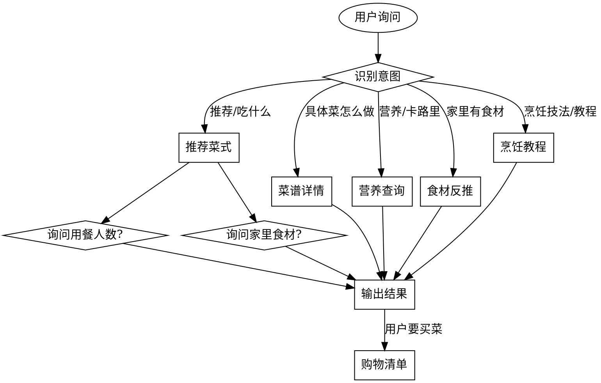

# How to Cook Skill

智能烹饪技能，基于 [HowToCook](https://github.com/Anduin2017/HowToCook) 构建。

## Overview

提供菜谱推荐、营养查询、食材反推、购物清单、烹饪技法教程等功能，帮助用户解决"今天吃什么"以及"怎么做"的问题。

## 前置条件

确保 `cooking-skill` 项目已就绪，索引文件存在：

```bash
ls cooking-skill/data/recipes_index.json
ls cooking-skill/data/tutorials_index.json
```

如不存在，先构建索引：

```bash
cd cooking-skill && python chef_skill.py build
```

## 何时使用

用户表达以下意图时自动触发：
- "今天吃什么"、"不知道吃什么"
- "想吃点简单的/辣的/低卡的"
- "XX 怎么做"、"XX 多少卡路里"
- "家里有 XX 能做什么菜"
- "推荐几道菜，我要去买菜"
- "怎么焯水"、"蒸菜技巧"、"炒和煎的区别"等烹饪技法问题

## 交互流程



## 参数收集

### 推荐时主动询问

| 参数 | 询问方式 | 默认值 |
|------|---------|--------|
| 用餐人数 | "几个人吃饭？" | 2 人 |
| 场景 | "工作日快手菜还是周末大餐？" | 工作日 |
| 饮食偏好 | "有没有忌口或想吃的口味？" | 无 |
| 家中食材 | "家里有哪些食材？（没有就跳过，生成购物清单）" | 无 |

## 命令执行

通过 `chef_skill.py` 执行操作，在 `cooking-skill/` 目录下运行：

### 推荐菜式

```bash
python chef_skill.py recommend --people 3 --shopping-list
```

选项：
- `--people N` - 用餐人数
- `--scene workday/weekend` - 场景
- `--diet low_fat` - 低脂模式
- `--no-spicy` - 不吃辣
- `--low-cal` - 低卡路里
- `--ingredients A B` - 家中食材
- `--shopping-list` - 生成购物清单

### 搜索菜谱

```bash
python chef_skill.py search 关键词
```

### 菜谱详情（含做法）

```bash
python chef_skill.py detail 菜名 --servings 2
```

### 营养信息

```bash
python chef_skill.py nutrition 菜名
```

### 食材反推

```bash
python chef_skill.py ingredients 食材1 食材2
```

### 烹饪教程

```bash
python chef_skill.py tutorial 关键词
```

示例：
- `python chef_skill.py tutorial 焯水` - 查看焯水教程
- `python chef_skill.py tutorial 蒸` - 查看蒸菜技巧
- `python chef_skill.py tutorial` - 列出所有教程

## 输出格式

### 推荐卡片

```
今日推荐（3 人份）
========================================

1. 宫保鸡丁
   卡路里: 380kcal | 蛋白质: 28g | 碳水: 15g | 脂肪: 22g
   难度: ★★ | 预计时间: 15-25 分钟
   类型: 荤菜 | 辣度: ★★★/5 | 口味: 麻辣

2. 清炒花菜
   卡路里: 85kcal | 蛋白质: 3g | 碳水: 12g | 脂肪: 4g
   难度: ★ | 预计时间: 5-15 分钟
   类型: 素菜 | 不辣 | 口味: 清淡
```

### 菜谱详情

```
【宫保鸡丁】
========================================
难度: ★★ | 辣度: ★★★/5 | 卡路里: 380kcal/份
预计时间: 15-25 分钟
类型: 荤菜

食材（2 人份）：
  - 鸡胸肉 200g
  - 花生 50g
  - 干辣椒 10g
  ...

步骤：
  1. 鸡胸肉切丁，加料酒、淀粉腌制 10 分钟
  2. ...
```

### 烹饪教程

```
【学习焯水】
========================================
来源: tips/learn/学习焯水.md

为什么需要焯水？
  - 去除食材中的血水和杂质
  - 减少草酸等不利于钙吸收的物质
  - 使蔬菜颜色更鲜艳

适用食材：
  - 肉类：排骨、五花肉、牛肉等
  - 蔬菜：菠菜、西兰花、豆角等

操作方法：
  1. 冷水下锅：将食材放入冷水中
  2. 大火煮沸：开大火将水煮沸
  3. 撇去浮沫：用勺子撇去表面的浮沫
  4. 捞出冲洗：将食材捞出，用清水冲洗干净
  ...
```

### 购物清单

```
购物清单（宫保鸡丁 + 清炒花菜）
========================================
需要购置：
  - 鸡胸肉 200g
  - 花生 50g
  - 花菜 1 颗
```

## 推荐策略

### 按人数搭配
- 1-2 人：2 道菜
- 3-4 人：4 道菜
- 5-6 人：6 道菜

### 季节性调整
自动根据当前月份调整推荐：
- 春：清淡、时令蔬菜
- 夏：凉拌、清蒸
- 秋：润燥、煲汤
- 冬：炖菜、红烧、热汤

### 低脂餐
过滤高脂肪食材（五花肉、油炸类），优先蒸/煮/凉拌做法。

### 菜品去重
避免推荐主要食材重复的菜式（如不会同时推荐两道都用大量鸡蛋的菜）。

## 烹饪教程体系

教程文档来自 HowToCook 仓库的 tips/ 目录，涵盖：

### 基础指南
- 厨房准备 - 厨房必备工具、调料等
- 如何选择现在吃什么 - 决策帮助
- 食材相克与禁忌 - 食材搭配禁忌

### 烹饪技法 (tips/learn/)
- 学习焯水 - 焯水技巧
- 学习炒与煎 - 炒和煎的区别与技巧
- 学习蒸 - 蒸菜技巧
- 学习煮 - 煮菜技巧
- 学习凉拌 - 凉拌菜制作
- 学习腌 - 腌制技巧
- 高压力锅 - 高压锅使用指南
- 空气炸锅 - 空气炸锅使用指南
- 微波炉 - 微波炉使用指南
- 去腥 - 食材去腥技巧

### 高级技巧 (tips/advanced/)
- 辅料技巧 - 辅料处理方法
- 糖色的炒制 - 炒糖色技巧
- 油温判断技巧 - 如何判断油温
- 高级专业术语 - 烹饪专业术语解释

## 营养数据来源

营养数据基于公开营养数据库估算，仅供参考。辣度通过食材关键词推断（0-5 级）。

## 同步更新

菜谱索引和教程文档可通过以下命令从 HowToCook 仓库同步更新：

```bash
python chef_skill.py sync
```
